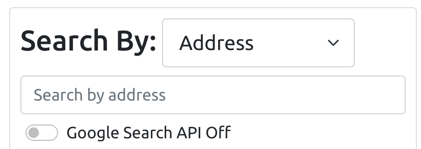
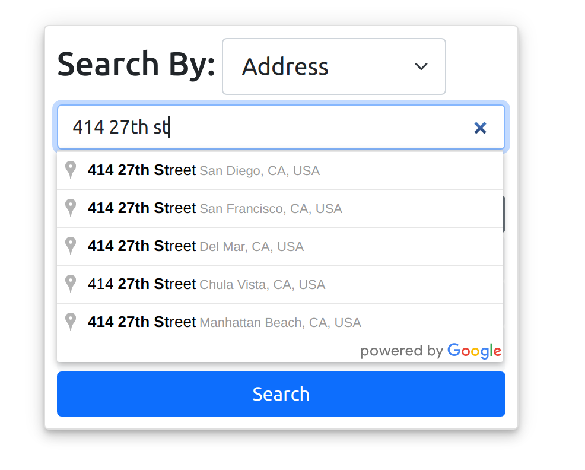
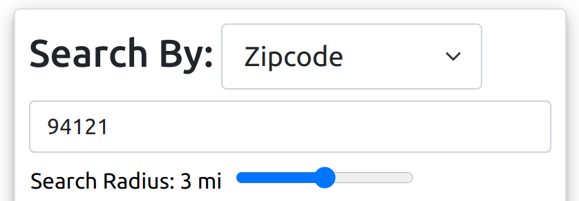
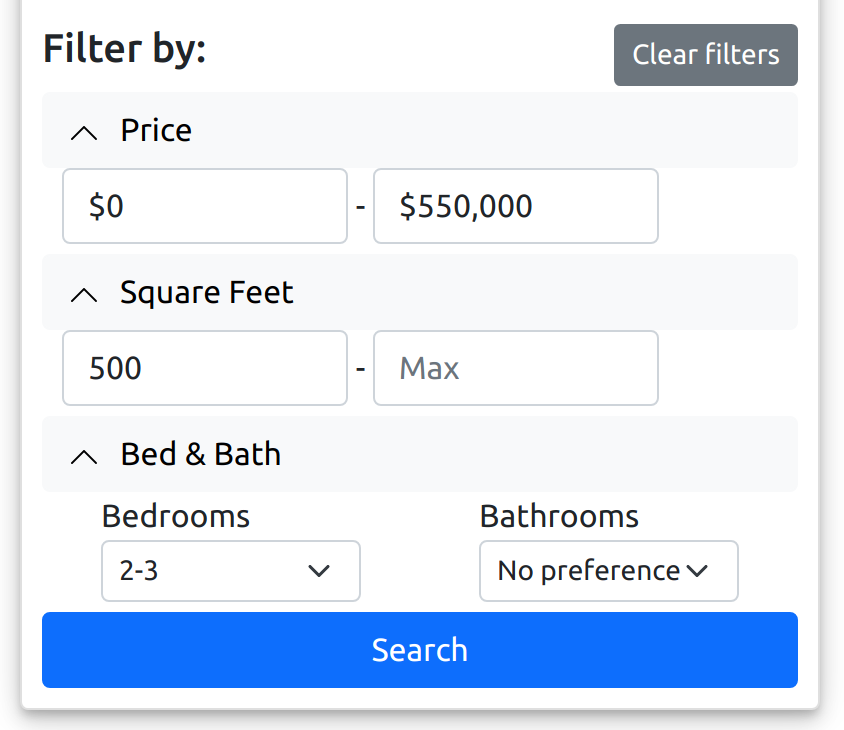
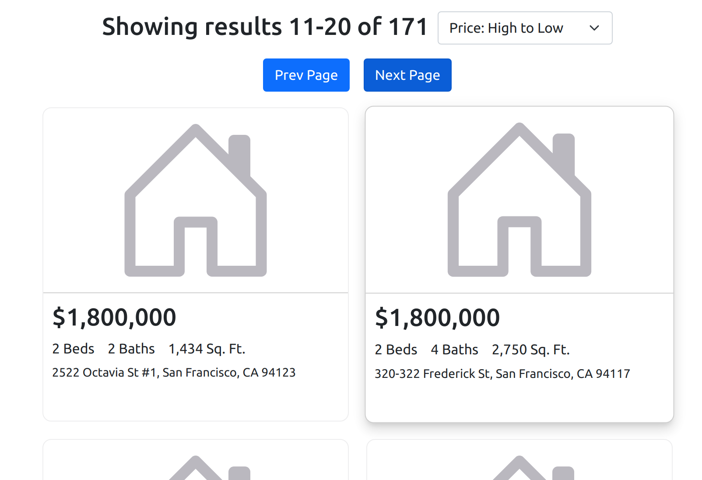

# symptoStreet
## Description: 
Sympto-street allows users to search from current Redfin housing listings in the San Francisco area (currently only 350 listings in the database).

### Instructions:
Users can search listings by either address or zipcode:
- ### Address
    - Google API (toggled off): performs a direct text search of addresses within the mongoDB database
        - 
    - Google API (toggled on): incorporates Google's Map Places API to autocomplete addresses based on user input. Selected address contains geocode results (longitude/latitude), which are reversed into a zipcode via 'reverse-geocode' package. Server accepts the zipcode query, generates zipcodes within a 3 mile radius via the 'zipcodes' package, and then searches the database for listings with matching zipcodes.
        - 
- ### Zipcode
    - User inputs a zipcode and can select a preferred search radius. 
    - Search radius limited to 5 miles since all listings within the database are selected at that point
        - 
- ### Filters
    - Users can also add filters for a more narrow search
        - 
 
- ### Results
    - Results are presented in groups of 10 per page, and can be sorted by price (low to high, high to low)
        - 


## Installation: 

1) Clone the repository into a local folder:
    ```
    git clone https://github.com/YipAnthony/symptoStreet.git .
    ```
2) Navigate to the server folder (sympto-street/server) and install dependencies
    ```
    cd server/
    npm install
    ```
    Start the local server:
    ```
    npm run serverstart
    ```

3) Navigate to the client folder (sympto-street/client) and install dependencies
    ```
    cd ../client/
    npm install
    ```
    Start the front-end site:
    ```
    npm start
    ```

